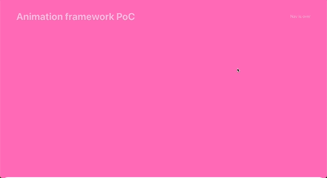

# Webpage sectional animation framework PoC

An animation framework prototype/proof-of-concept (PoC) that allows you to animate in section elements on a webpage with many sections. Sections follow a specific template and have certain requirements as well.

This set of requirements is for a particular project so it is very specific & in its entirity might not be applicable to other projects, but parts of it might be useful to repurpose.

## 🏁 Features/objectives

1. each page has multiple sections
2. each section has the following elements: background colour, content (heading, text, image) and optional background footer
3. only the 1st section will have a background header, if sticky header (mislabelled "nav bg") is set to `true` it should kick in as you begin to scroll down the page; but not on render when page is in original position, as 1st section has a static header already
4. you should be able to animate in elements with different timings and direcions (section contents)
5. animations to be triggered by scrolling into sections; once animated in, they do not need to animate out on reverse scroll
6. a section can also dictate what the sticky header should be like when that section is active (example: sticky header/"nav bg" background colour should match the section's background colour)
7. on window resize, calculations should update in an optimised way so everything works correctly (not yet implemented)
8. this PoC is limited to desktop resolution (not responsive, doesn't support mobile/tablet views)
9. sections should be a reuseable component
10. section background colours should blend with other sections automatically
11. use react.js & `IntersectionObserver`

## 🖥️ Tech

1. [vite.js](https://vitejs.dev/) `v4.3`
2. [react.js](https://react.dev/) `v18.2`
3. [Intersection Observer API](https://developer.mozilla.org/en-US/docs/Web/API/Intersection_Observer_API)

## 🚀 How to run

1. Fork & clone this repo
2. Have Node `v18` (or newer),
3. Get `yarn` or `npm`
4. In terminal go to DIR &amp; `cd animation-frameework`
5. Run `yarn` or `npm install`
6. On successful installation, run `yarn dev` or `npm run dev`
7. Finally, open [http://localhost:5173](http://localhost:5173) in your browser to view the app.

## 📝 Notes

1. cool CSS colours & their names [here](https://www.quackit.com/css/css_color_codes.cfm)
2. helpful: https://css-tricks.com/an-explanation-of-how-the-intersection-observer-watches/
3. [helpful codepen](https://codepen.io/bot19/pen/VwVvRbq) from the article above (my fork, fixed an issue)
4. ChatGPT 3.5 assisted; [my demo #1](https://codesandbox.io/s/test-react-intersectional-observer-set-section-as-active-when-majority-in-vp-9lvnsv) of functionality required
5. [my demo #2](https://codesandbox.io/s/test-react-intersectional-observer-nav-knows-which-section-it-is-over-gyjpvj) making the nav know which section it is over
6. FIXME: when a section exceeds the viewport height greatly, I can't the IntersectionObserver to behave correctly like with other sections
